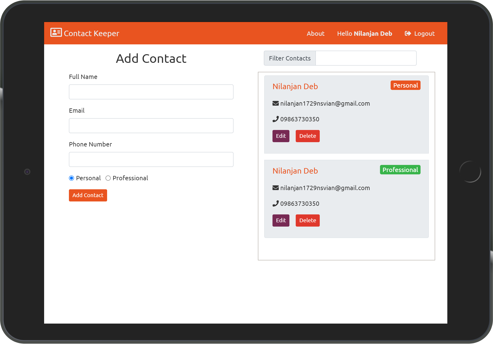

# Contact Keeping App

- #### This site is live [here](https://contact--keeper.herokuapp.com/).
- #### Github Repository [link](https://github.com/nil1729/contact-keeper).

---

### Modules used for this Project

1. _`NodeJS`_ is used for building Backend part of this Website.
2. _`MongoDB`_ used for Database to store data.
3. _`ExpressJS`_ is used as Backend Framework.
4. _`React JS`_ is used as frontend Framework for building SPA.
5. _`Bootswatch united Theme`_ is used as CSS Framework and the website is Responsive for all Devices.
6. _`JWT`_ is used for Authentication purpose.
7. Token will be stored in `Local Storage` of Client Browser.
8. Encrypt passwords with `bcrypt`
9. Add Some Transition Effects to Contacts using `react-transition-group`.

---

### Website Preview

## 

Made With &#10084; by <a href="https://github.com/nil1729" target="_blank"> Nilanjan Deb </a> 

